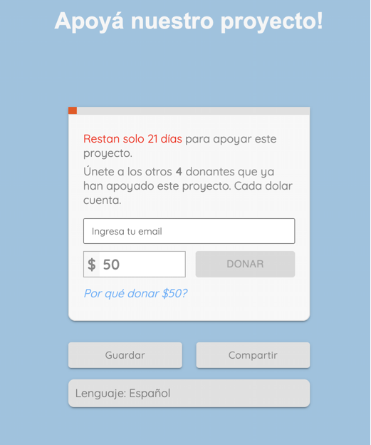
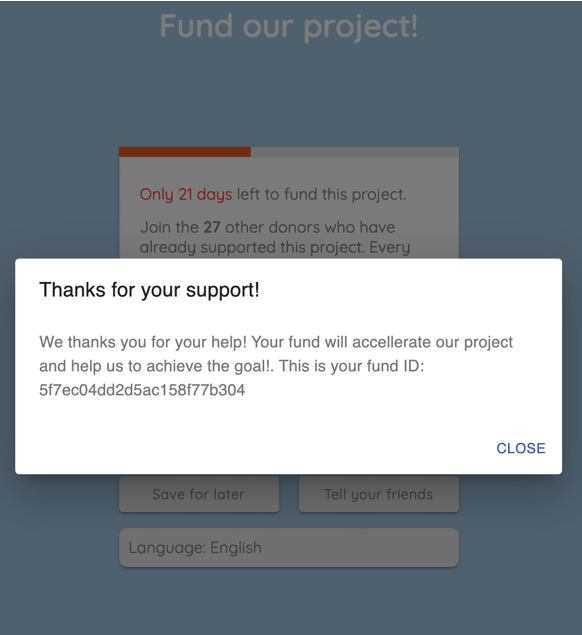
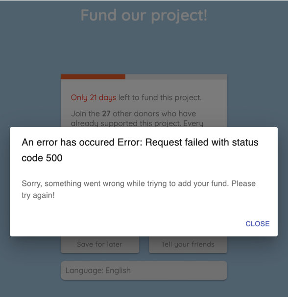
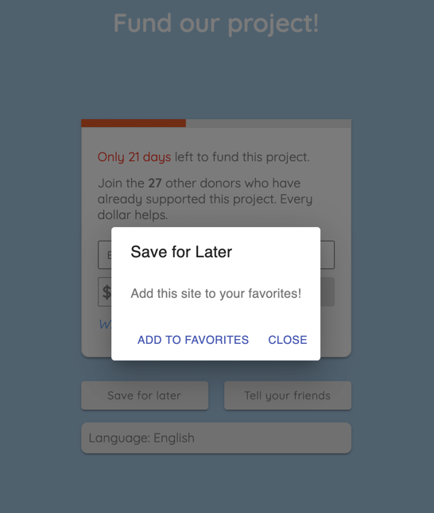

# front-funds-app
This is the FrontEnd for the Funds App. 

The App is created with ReactJS, with a custom webpack implementation so we can use SASS Styling and ECMAScript6 Syntax. 


## BackEnd (Express API)
If you're looking for the BackEnd API you can find it in the [api-funds-app](https://github.com/Manumac86/api-funds-app) repo.

## Local Development
Please refer to our [Local Development Docs](docs/LocalDevelompent.md)

## The Development Process
If you're interested in the background behind this app, you can read more at our [Development Process Docs](docs/DevProcess.md).

## Production
The process to build a production version is run by webpack. We can run the `npm run build` script in order to create a production ready version.

### Deploy
The FrontEnd App is hosted in Firebase Hosting. The production version can be found in the following domain: 
[fronnt-funds-app.web.app](https://front-funds-app.web.app/)

Go try it and Fund a project!

## AppFlow
### First Load
On load, the app performs two requests to the API. 
The first one is the AUTH request with `POST` methodto `https://mysterious-springs-20524.herokuapp.com/api/auth/token` to get the `APIToken` to authenticate. 
The second one, is to get the Funds List and is a `GET` request to `https://mysterious-springs-20524.herokuapp.com/api/funds`. The response contains the list of current funds in the database. We need this data to show the number of donors and the amount left to reach the funds goal.

Once the app loads the data, it shows the following screen: 
.

### Progress Bar, Tooltip and Description: 
The red progress bar in the top of the Funds Card, shows the current progress of the funding.
If you hover in the progress bar, you will see the Tooltip showing the total amount left to reach the project goal.
by default, the Project Goal is set to $10.000 and the Date limit is set to `October 30, 2020`. 
The number of days left to fund the project and the number of donors are dynamic and change when a new found is made or a new day begun.

### Languages
The app will load in the `localStore` selected language or in the browser language, but you can select your prefered language at the bottom of the page. You can choos between English, Spanish or Italian.

### Payments and Form Data
We've decided to add an email input beside the amount input, in order to get the data from the donors to give them special news about the project in the future and to process payments via email. This input is required and will be validated in the Frontend (the input value will change the color if the email hasn't a valid format and the Give Now button will be disabled until a valid email is detected) and in the Backend for double validation. 

In a future iteration of this app, we'll add Payment Passports to make the payment directly from the app.

### Sending a Fund
The user can modify the amount of money to fund the project and click the `Give Now` button to add the fund.
This action will trigger a request to `https://mysterious-springs-20524.herokuapp.com/api/funds` with the `POST` method and send the body with the following data: 

```
{
  amount: 50,
  email: "manumac@manu.com"
}
```

The form will show a loader until the response is received and then will show a Modal with the result.
If the response is a Success, then the message will be displayed alond the Fund ID, like the following image: 


If an error ocurs, the Modal will display the following message: 


After the modal is closed, the app reloads in order to get the updated data and update the UI.

### Footer Buttons
We've added two buttons in the Footer to perform the following actions: 
- Save For Later: It opens a modal with a message:

Both option buttons close the modal.

- Tell Your Friends: It opens Twitter with the Twit window open so the user can paste the link to our Project Funding App. 


## Scripts
### ESLint
We've implemented ESLint to lint our code to avoid syntax errors, based on the AirBnB standard. You can see the config in [this file](.eslintrc.json).
Also, there's a script available to run the lint process. To run this validation, just run the following command in the terminal:
```
npm run lint
```

### Prettier
We've implemented Prettier to fix indentations errors, trailing commas and singleQuotes in our code to prettify and standarize our code look. You can see the config in [this file](.prettierrc).

Also, there's a script available to run the prettier process. To run this validation, just run the following command in the terminal:
```
npm run pretty
```

### Babel
We're using ECMAScript6 Syntax. To do this, we've implemented [Babel](https://babeljs.io/) in our webpack config to transpile ES6 code into ES5. You can see the config in [this file](.babelrc).

